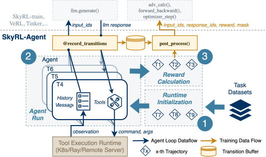
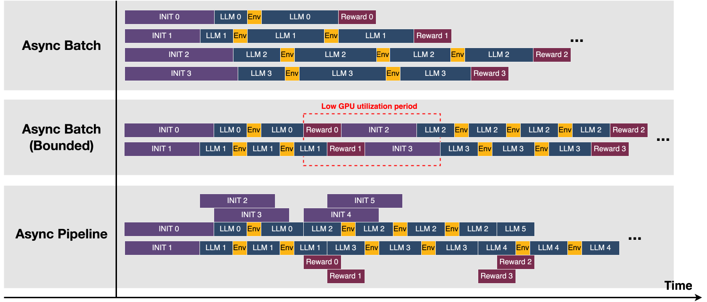
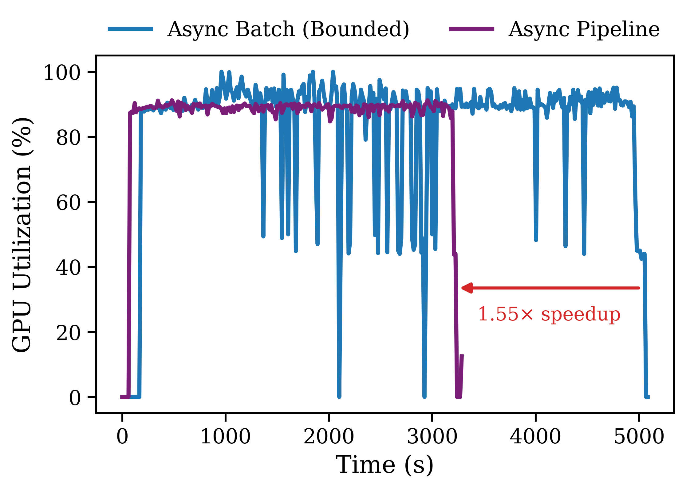
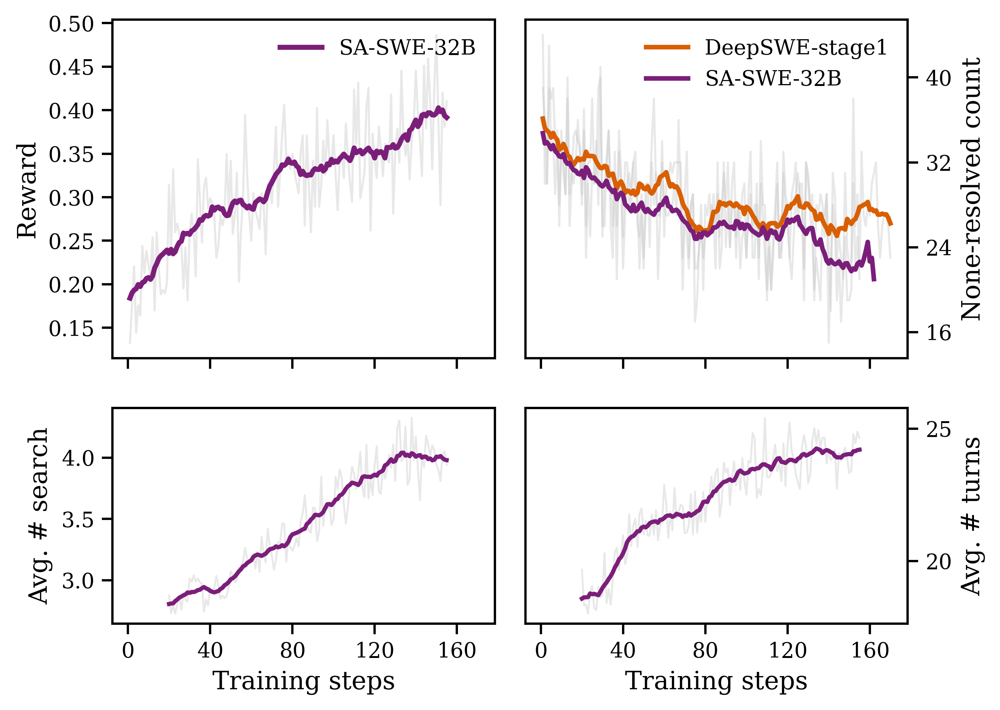

<div align="center">


Training and evaluating modern AI agents with modular tasks, tools, and backends.

[](https://arxiv.org/pdf/2511.16108)
[](https://huggingface.co/NovaSky-AI/SA-SWE-32B)

<br/>

<br/>

</div>

## News 📰✨

- 🚀 Initial public release with SWE, MemAgent (step-wise training), and Web Research examples!

## Why SkyRL-Agent

- Unified interface for agentic tasks and training backends
- Pluggable tools (browser, search, code execution, finish, etc.)
- Efficient and flexible async dispatching strategies
- Works with OpenAI-compatible serving (vLLM/others), VERL, SkyRL-Train, Tinker. Switch the backend with one line configuration!

<p align="center">
  
</p>

## Quickstart

```bash
git clone --recurse-submodules https://github.com/NovaSky-AI/SkyRL.git 
# our working directory
cd skyrl-agent
```

Then head to the `examples/` folder to run tasks (training and inference). Each task’s script/YAML documents its own knobs and environment requirements.

## Results & Profiling (glimpses)

<p align="center">
  
  &nbsp;&nbsp;
  
</p>

## Roadmap

- [ ] OSWorld Integration
- [ ] Simplify SWE agent training code path
- [ ] More training recipes
- [ ] Evaluation harness unification

## Acknowledgements
Huge thanks to these projects:
- [VERL](https://github.com/volcengine/verl)
- [OpenHands](https://github.com/OpenHands/OpenHands)
- [LocAgent](https://github.com/gersteinlab/LocAgent)
- [R2E-Gym](https://github.com/R2E-Gym/R2E-Gym)
- [Tinker Cookbook](https://github.com/thinking-machines-lab/tinker-cookbook)
- [rLLM](https://github.com/rllm-org/rllm)
- [WebThinker](https://github.com/RUC-NLPIR/WebThinker)
- [WebSailor](https://github.com/Alibaba-NLP/DeepResearch)
- [ARPO](https://github.com/dvlab-research/ARPO)
- [MemAgent](https://github.com/BytedTsinghua-SIA/MemAgent)

## Citation

```bibtex
@article{cao2025skyrl,
  title={SkyRL-Agent: Efficient RL Training for Multi-turn LLM Agent},
  author={Cao, Shiyi and Li, Dacheng and Zhao, Fangzhou and Yuan, Shuo and Hegde, Sumanth R and Chen, Connor and Ruan, Charlie and Griggs, Tyler and Liu, Shu and Tang, Eric and others},
  journal={arXiv preprint arXiv:2511.16108},
  year={2025}
}
```