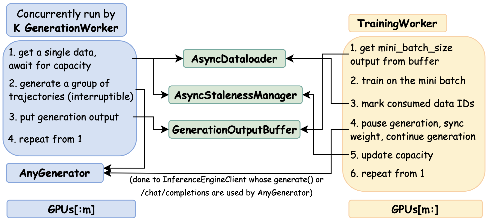
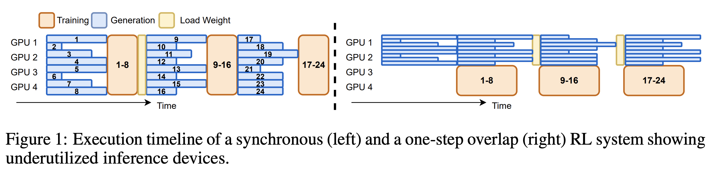
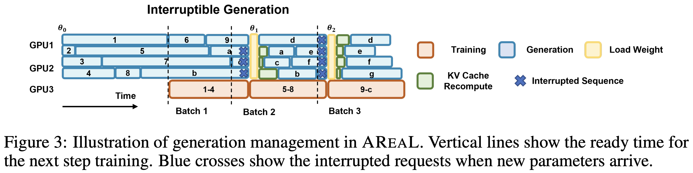

(Experimental) Fully Async Training: In-flight Weight Update / Multi-Turn Partial Rollout
=========================================================================================

SkyRL supports fully async training for any generator that implements the ``GeneratorInterface``, including your **arbitrary agent harness (both single-turn and multi-turn)**, to address the **straggler issues in long-horizon tasks**.

We treat "fully async training" synonymous to the terms **"in-flight weight update"** and **"multi-turn partial rollout"**, as discussed in works like AReal, PipelineRL, ScaleRL, etc.

The core logic of fully async training lives in `fully_async_trainer.py <https://github.com/NovaSky-AI/SkyRL/blob/main/skyrl-train/skyrl_train/fully_async_trainer.py>`_, a subclass of the synchronous trainer class in `trainer.py <https://github.com/NovaSky-AI/SkyRL/blob/main/skyrl-train/skyrl_train/trainer.py>`_. This ``fully_async_trainer.py`` works out-of-the-box with any generator that the user implements -- so users do not need to implement any additional logic for fully async training.

   
   **Overview of Fully Async Training in SkyRL**

.. contents:: Table of Contents
   :local:
   :depth: 2
   :backlinks: none

.. note::

    The fully async training is currently only supported for Generators that use ``/chat/completions``. We will support ``.generate()`` and ``/completions`` soon.

I. What is Fully Async Training?
---------------------------------

There are three types of RL training we are interested in here, well-depicted by AReal's Figure 1 and Figure 3.

   
   **AReal Figure 1: Synchronous Training vs. One-Step-Off Async Training**

a. Synchronous Training
~~~~~~~~~~~~~~~~~~~~~~~~

In AReal's figure 1 LHS, we have the traditional synchronous training, colocating training and generation on the same set of GPUs.

- Pro: easy to implement and set up. Works for most small-scale tasks like gsm8k. Always on-policy (if ``train_batch_size == policy_mini_batch_size``).
- Con: cannot scale training and generation separately.

b. One-Step Off-Policy Async Training
~~~~~~~~~~~~~~~~~~~~~~~~~~~~~~~~~~~~~~~~~

In AReal's figure 1 RHS, we have one-step off-policy pipelining, also supported by SkyRL and discussed in :doc:`one_step_off_async`.

Here we split the GPUs into two groups, dedicated to training and generation respectively. We first generate a batch of trajectories to start the pipeline, and the trainer always trains on the one-step-stale batch of trajectories (hence one-step off).

- Pro: still relatively easy to implement and setup.
- Con: as shown in the figure, stragglers in a generation batch will stall both generation and training, decreasing throughput. This is especially an issue for long-horizon tasks.

c. Fully Async Training (this page)
~~~~~~~~~~~~~~~~~~~~~~~~~~~~~~~~~~~~~~~~~~

   
   **AReal Figure 3: Fully Async Training**

Both approaches above suffer from the straggler issues in generation. Fully async training addresses this with in-flight weight update. After the trainer finishes a training step, we: 1) pause the generation of the ongoing trajectories, 2) update the generator weights in-flight, 3) resume generation of the trajectories.

This effectively addresses the straggler issues. While it may sound unintuitive at first (a trajectory can be generated by multiple model versions), it has worked well in practice according to the literature. 

II. How to use fully async training in SkyRL?
----------------------------------------------

The fully async trainer class is implemented in ``fully_async_trainer.py::FullyAsyncRayPPOTrainer``, subclassing the synchronous trainer class ``trainer.py::RayPPOTrainer``.

This trainer class is generator-agnostic, meaning it can support any generator that implements the ``GeneratorInterface`` interface, including your arbitrary agent harness.

We provide an example script in ``examples/fully_async``, where we train Qwen2.5-1.5B-Instruct on GSM8K with the fully async approach.

We break down the usage into two simple steps.

Step 1: Define your ``main_async.py``
~~~~~~~~~~~~~~~~~~~~~~~~~~~~~~~~~~~~~

Following `examples/fully_async/main_async.py <https://github.com/NovaSky-AI/SkyRL/blob/main/skyrl-train/examples/fully_async/main_async.py>`_, subclass the base entrypoint class ``BasePPOExp``:

- Override ``get_trainer()`` to use fully async trainer class ``FullyAsyncRayPPOTrainer``
- Override ``get_generator()`` to use your custom generator class. Note that currently we only support generators that use ``/chat/completions`` (hence the ``SkyRLGymHTTPGenerator`` used in the example).

Step 2: Config knobs to tune for fully async training
~~~~~~~~~~~~~~~~~~~~~~~~~~~~~~~~~~~~~~~~~~~~~~~~~~~~~

Following `examples/fully_async/async_run_gsm8k.sh <https://github.com/NovaSky-AI/SkyRL/blob/main/skyrl-train/examples/fully_async/async_run_gsm8k.sh>`_, update the training configuration to use your new entrypoint ``main_async.py``:

.. code-block:: bash

    uv run --isolated --extra vllm -m examples.fully_async.main_async \
    ...

For fully async specifically, the following are the main knobs to tune:

- ``trainer.policy_mini_batch_size``: The mini-batch size for policy training. The trainer triggers a training step whenever the generation workers have generated this many groups of trajectories.
- ``trainer.fully_async.max_staleness_steps``: The maximum off-policy steps allowed for each training batch, trading off between throughput and off-policy bias. See :ref:`async-staleness-manager` for more details.

  - ``max_staleness_steps = 0`` is equivalent to synchronous training (despite wasting throughput since we cannot overlap training and generation).
- ``trainer.fully_async.num_parallel_generation_workers``: The number of generation workers to spawn, where
  each worker works on a group of trajectories. It should be ``>= trainer.policy_mini_batch_size`` to avoid wasted throughput, 
  and ``<= trainer.policy_mini_batch_size * (trainer.fully_async.max_staleness_steps + 1)`` since it would be wasted due to capacity control.
  The larger the number, the more throughput, and likely more staleness (and hence off-policy-ness).

On GPU placement: first disable colocation of training and generation, then configure how many GPUs to dedicate to training and generation respectively. The following snippet dedicates 4 GPUs to each.

.. code-block:: bash

    trainer.placement.colocate_all=false \
    trainer.placement.colocate_policy_ref=true \
    trainer.placement.policy_num_gpus_per_node=4 \
    trainer.placement.ref_num_gpus_per_node=4 \
    generator.num_inference_engines=4 \
    generator.inference_engine_tensor_parallel_size=1

Other restrictions (will be validated by the trainer):

- ``trainer.train_batch_size``: Must be set to the same as ``trainer.policy_mini_batch_size``.
- ``generator.batched``: Must be set to ``false`` to use non-batched vLLM engines.
- ``generator.async_engine``: Must be set to ``true`` to use async vLLM engines.
- ``trainer.algorithm.dynamic_sampling.type``: Must be set to ``"none"`` to disable dynamic sampling (not supported yet).

III. Design and Implementation of Fully Async Training in SkyRL
----------------------------------------------------------------

0. Overview
~~~~~~~~~~~

The high-level control logics of fully async training in SkyRL are shown in the figure below.

   
   **Systems Diagram of Fully Async Training in SkyRL**

There are 5 core components:

1. K ``GenerationWorker``: workers that produce the trajectories. Each is simply an ``asyncio.Task`` that runs ``AnyGenerator.generate()``. K is ``trainer.fully_async.num_parallel_generation_workers``. ``AnyGenerator`` means that it works with any generator.
2. ``TrainingWorker``: simply a single thread that runs the training loop.
3. ``GenerationOutputGroupBuffer``: a buffer that stores the generated groups of output.
4. ``AsyncDataloader``: a thin wrapper of the dataloader, polled by the generation workers to get data.
5. ``AsyncStalenessManager``: a controller that manages the staleness control to ensure no trajectory is dropped for being too stale.

Note that all the control logics pertain to a single epoch. We do not do any cross-epoch asynchrony.

Besides, we define ``group`` as the smallest unit of data in the control logic. A group (in GRPO sense)
is a set of ``generator.n_samples_per_prompt`` number of trajectories generated for the same prompt.

1. K Generation Workers
~~~~~~~~~~~~~~~~~~~~~~~~

Generation workers are virtual workers, each is simply an ``asyncio.Task`` that runs ``generator.generate()``
for a group of trajectories. There is only one ``generator`` instance (e.g. ``SkyRLGymGenerator``) and one
physical ``InferenceEngineClient`` in the back serving the actual LLM inference.

Each generation worker runs the following steps in a while loop:

1. Get a single data from the ``AsyncDataloader``. Might await on staleness control based on ``AsyncStalenessManager`` (i.e. too many data accumulated in the buffer and a new generation will result in staleness violation).
2. Generate one group of trajectories. Can be single-turn or multi-turn, ``SkyRLGymGenerator`` or your own generator.
3. Enqueue the generated group to the ``GenerationOutputGroupBuffer``.
4. Repeat from step 1 until the ``AsyncDataloader`` is exhausted for this epoch.

2. Training Worker (i.e. the training loop)
~~~~~~~~~~~~~~~~~~~~~~~~~~~~~~~~~~~~~~~~~~~~~~~~

While we call it a "training worker", it is simply the single thread that runs the training loop.

It follows the following steps in a for-loop over the number of steps per epoch:

1. Get precisely ``trainer.policy_mini_batch_size`` groups from the ``GenerationOutputGroupBuffer``.
   The staleness controller enforces a global capacity bound that aims to keep batches within ``trainer.fully_async.max_staleness_steps`` steps stale. However, it does not strictly guarantee it. See :ref:`async-staleness-manager` for more details.
2. Train on the generated groups.
3. Mark the data that we used to train as "consumed" to the ``AsyncDataloader``, so that when we resume
   training from a checkpoint, we know what data has been trained on and hence can be skipped.
4. Make ``AnyGenerator`` (really the ``InferenceEngineClient`` in the back): pause generation, sync weights, resume generation. Note that this operation is agnostic to what the generator is doing. It can either be in the middle of a ``/chat/completions`` generation, or interacting with the environment.
5. Update the global step and hence the capacity controlled by the ``AsyncStalenessManager``, potentially unblocking
   generation workers stuck on step 1 -- as they can now generate new data that will not be as stale as before.
6. Repeat from step 1 until the epoch is done.
   

3. Generation Output Group Buffer
~~~~~~~~~~~~~~~~~~~~~~~~~~~~~~~~~

The generation output group buffer is simply a ``asyncio.Queue`` that stores the generated groups of output.
It is enqueued by the generation workers, and dequeued by the training worker.

4. Async Dataloader
~~~~~~~~~~~~~~~~~~~

The async dataloader is a thin wrapper around the ``torchdata.stateful_dataloader.StatefulDataLoader`` we use in sync training or one-step-off async training. It is implemented to satisfy the following requirements of fully async training:

- Thread-safe dataloader iteration with a lock, as there are multiple concurrent generation workers polling data.
- Records consumed data UIDs for checkpointing to avoid training on the same data upon resuming.
- Do proper trimming of the dataset to ensure that the dataloader always returns a full mini-batch.

  - We cannot rely on ``drop_last`` because the batch size is 1 in fully async training (since each generation worker works on a single group at a time).
  - We also cannot trim the ``train_dataset`` before building the dataloader, because it will affect the random permutations of the dataset, and the data order of async training will be different from synchronous training. However if we keep the datasets the same, even if the batch size of the dataloader is different, the permutation is the same after aggregating the batches of size one to the same size as the mini-batch size.

The ``AsyncDataloader`` is used in the following cases:

- The generation workers poll data from the ``AsyncDataloader`` to generate trajectories.
- The trainer marks the data that has been used to train as "consumed" to the ``AsyncDataloader``
- Upon checkpointing, save the consumed data UIDs along with other checkpointing states, so that when we resume training from a checkpoint, we know what data has been trained on for this epoch and hence can be skipped.
- Reset to the initial state at the end of each epoch.

.. _async-staleness-manager:

5. Async Staleness Manager
~~~~~~~~~~~~~~~~~~~~~~~~~~~~

The async staleness manager makes sure generation never outruns training beyond the user-specified
bound ``trainer.fully_async.max_staleness_steps``. It enforces a simple, global capacity rule so
that groups waiting in the buffer or currently being generated are never "too stale" relative to the
latest trained model.

Modeled after AReal's `StalenessManager <https://github.com/inclusionAI/AReaL/blob/b755c4447c2fff97889d8828293ee85f17a806f9/areal/core/staleness_manager.py>`_ (paper §5.1), our controller maintains a small set of global counters and enforces a simple capacity inequality.

Definitions
^^^^^^^^^^^

- **Consumed by trainer**: groups that have already been used for updating the model weights.
- ``current_global_step``: the model version currently being worked on; the model has completed ``current_global_step - 1`` updates.
- ``mini_batch_size = B``: number of groups consumed per training step.
- ``max_staleness_steps = S``: the maximum allowed difference between when a group was scheduled to generate, and the step that trains on it.
- ``accepted``: total number of groups that finished generation (either already consumed or waiting in the buffer). This includes all the generation outputs throughout the entire training process. Thus, this number is strictly increasing.
- ``running``: number of groups currently being generated by workers.
- ``submitted``: total number of groups submitted to workers (used for logging).

Capacity control
^^^^^^^^^^^^^^^^

At ``current_global_step``, the maximum number of groups the system may have progressed
since the very beginning of the training (counting both completed and in-flight generation) without violating the staleness bound is::

  capacity = (S + current_global_step) * B

To stay within the bound, the manager guarantees::

  accepted + running <= capacity

Intuition:

- Of the capacity, ``(current_global_step - 1) * B`` have already been consumed by training.
- The remainder is the "headroom" the system can be ahead of training: items already in the buffer (``accepted - consumed``) plus items currently being generated (``running``).
- Each time training finishes a step, ``current_global_step`` increases by 1, expanding capacity by ``B`` and unblocking generation.

Operationally, a generation worker:

1) Acquires capacity before starting a new group via ``await AsyncStalenessManager.acquire_submission_slot()``. This blocks until ``capacity - (accepted + running) > 0`` is satisfied. 
2) When the group finishes generation and is enqueued, it calls ``await AsyncStalenessManager.on_rollout_accepted()`` to convert one running slot into an accepted unit.  

After each training step, the trainer increments the version and calls
``await AsyncStalenessManager.notify_capacity_change(current_global_step)``, which increases capacity and wakes up blocked workers.

Per-sample staleness vs capacity bound
^^^^^^^^^^^^^^^^^^^^^^^^^^^^^^^^^^^^^^

The capacity inequality keeps generation from outpacing training by more than ``S`` steps in **aggregate**. It does **NOT** strictly guarantee that every trajectory group will be trained within ``S`` steps of when it was scheduled. In rare cases (e.g., very long rollouts), a trajectory group may complete after more than ``S`` steps have elapsed while the system as a whole still satisfies the capacity constraint. However, in **steady state**, staleness remains within the configured budget of ``max_staleness_steps``.

Possible ways for handling such rare groups that violate the ``S`` bound:

- **Current behavior**: Still accept the trajectory group for training, but log the staleness metrics with a warning.
  
  - Matches `PipelineRL's behavior <https://github.com/ServiceNow/PipelineRL/blob/67654d7905816f7526ab7ba6d064d996094879ce/pipelinerl/finetune_loop.py#L583-L588>`_ and `AReal's default behavior <https://github.com/inclusionAI/AReaL/blob/1e7cf19f6206acc65de83c96dac27666895e30e0/areal/core/workflow_executor.py#L569-L577>`_.
- Drop the trajectory group using ``AsyncStalenessManager.on_rollout_rejected()`` **(not supported yet but should be hackable)**

  - Matches AReal's behavior if the ``should_accept_fn`` is based on per-sample staleness.
- Drop the trajectory group and resample. Would require logics to ``AsyncDataloader`` to requeue the data. **(not supported yet but should be hackable)**

Checkpointing semantics
^^^^^^^^^^^^^^^^^^^^^^^

When saving a checkpoint, only trainer-consumed state is recorded. On resume, we set ``accepted := consumed`` (and do not restore those that were running or about-to-be-consumed in the buffer), which preserves the capacity invariant without reintroducing stale or partially generated work.

.. note::

    ``AsyncStalenessManager`` is a deliberate design choice. One could instead over-generate and drop groups that are too stale at training time. We prefer proactive admission control to avoid wasted compute and simplify buffer management. With very small ``S``, the system may stall more often; increasing ``S`` trades off stricter on-policy-ness for higher throughput.

.. note::

    Our capacity formula uses ``current_global_step`` directly (no ``+1``) because in SkyRL ``current_global_step`` denotes the version being worked on, whereas AReal's derivation counts completed versions. This matches the implementation in ``fully_async_trainer.py``.

IV. More Implementation Details
--------------------------------

1. How is in-flight weight update implemented by the inference engines?
~~~~~~~~~~~~~~~~~~~~~~~~~~~~~~~~~~~~~~~~~~~~~~~~~~~~~~~~~~~~~~~~~~~~~~~~

The main reason why we can support fully async training for any generator (single-turn or multi-turn) is that, the in-flight weight update is implemented by the inference engines, not the generator / agent harness that the users use.

To implement in-flight weight update, we need to change the semantics of ``/chat/completions`` (or ``.generate()``, ``/completions``) from "generate an output for a given input" to "generate an output for a given input, while possibly updating the model weights in the middle".

That is, when the weight update is happening, the generator / agent harness has no clue that this is happening
underlyingly as the ``/chat/completions`` endpoint is simply blocked and not returning.

This design makes the implementation of fully async training agnostic to the generator / agent harness as
the trajectory could be doing anything when weight update is happening -- in the middle of a output generation or in the middle of an interaction with the environment (where the next output generation will simply be blocked until the weight update is finished).

We implement this semantics by implementing SkyRL's ``InferenceEngineClient`` to keep calling the underlying
inference engine's ``/chat/completions`` endpoint in a while loop, until the finish reason is not an ``abort``.

Upon ``InferenceEngineClient.pause_generation()``, we abort all the in-flight ``/chat/completions`` requests,
and save the partial results, waiting to be re-fed into the underlying inference engine as a new
``/chat/completions`` request when ``InferenceEngineClient.resume_generation()`` is called.

See the following two PRs for more details:
- https://github.com/NovaSky-AI/SkyRL/pull/537
- https://github.com/NovaSky-AI/SkyRL/pull/557

2. How is checkpointing supported
~~~~~~~~~~~~~~~~~~~~~~~~~~~~~~~~~

The main challenge of performing checkpointing and resuming in fully async training is that, the 
dataloader's state is not reliable (which is usually used to save checkpoint in sync training). While some data could be retrieved, upon checkpointing, we have no clue whether a data has already been trained or not.

To address this, our ``AsyncDataloader`` records the data UIDs that have been consumed by the trainer. Upon resuming from a checkpoint, we load the consumed data UIDs and skip the data that has already been trained. Therefore, the state of the dataloader is not used at all.

V. Future Work
----------------

- Validate with correct algorithmic offset (importance weighting)
- Support fully async training for ``.generate()`` and ``/completions`` as well.
- Validate speedup and results with DAPO.
- How to make fully async training reproducible (at the cost of some performance degradation)?

References
-----------

- AReal: https://arxiv.org/abs/2505.24298v3
- PipelineRL: https://arxiv.org/abs/2509.19128v2
- ScaleRL: https://arxiv.org/abs/2510.13786
